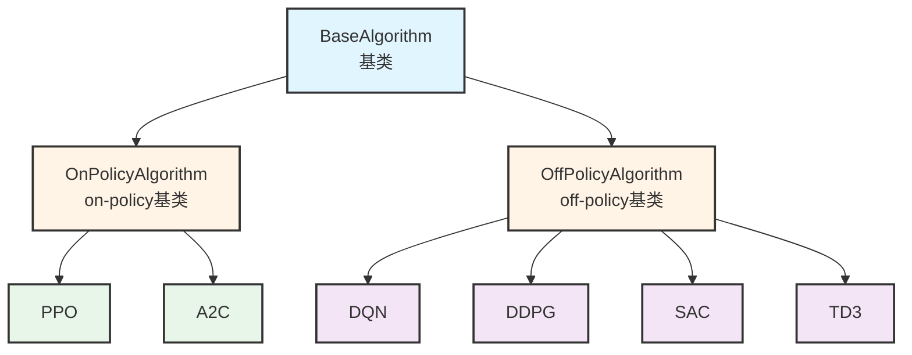
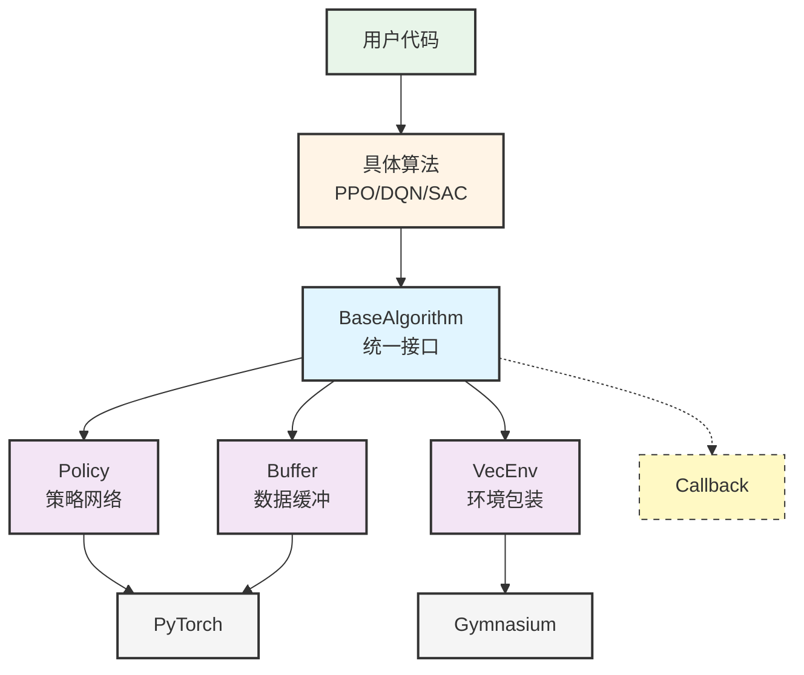

# Issue #01：项目地图与推荐阅读顺序

负责人：@成员03  
复核人：@成员01  
上游基线：见 `docs/project-baseline.md`

## 任务目标

为 Stable-Baselines3 项目梳理清晰的模块职责说明和代码阅读路径，帮助团队成员快速理解项目结构。

## 1. 项目基本情况

**统计数据**：
```bash
# 文件数量
find stable_baselines3/stable_baselines3 -type f -name "*.py" | wc -l
# 结果：64个Python文件

# 代码行数
find stable_baselines3/stable_baselines3 -type f -name "*.py" -exec wc -l {} + | tail -1
# 结果：15,693行代码
```

**目录结构**：
```
stable_baselines3/
├── __init__.py           # 入口文件
├── common/               # 公共模块（共享代码）
├── ppo/                  # PPO算法
├── a2c/                  # A2C算法
├── dqn/                  # DQN算法
├── ddpg/                 # DDPG算法
├── sac/                  # SAC算法
└── td3/                  # TD3算法
```

---

## 2. 项目地图

### 1.1 架构图

展示SB3的类继承关系：



**图说明**：
- 🔵 **蓝色（BaseAlgorithm）**：顶层基类，定义所有算法的统一接口（learn、predict、save、load）
- 🟡 **黄色（中间层）**：按数据使用方式分为on-policy和off-policy两类
- 🟢 **绿色（PPO、A2C）**：on-policy算法，训练后丢弃旧数据
- 🟣 **紫色（DQN、DDPG、SAC、TD3）**：off-policy算法，可重用历史数据

**解释**：SB3采用三层继承设计，所有算法共享统一的API，用户使用任何算法都是同样的方式。

---

### 1.2 模块协作地图

展示各模块在训练和预测时的协作关系：



**图说明**：
- 🟢 **用户代码**：调用SB3的API（如`model.learn()`）
- 🟡 **具体算法**：用户选择的算法（PPO、DQN等）
- 🔵 **BaseAlgorithm**：协调各模块的核心控制器
- 🟣 **核心模块**：Policy负责决策，Buffer存储数据，VecEnv管理环境
- 🟨 **辅助模块**：Callback监控训练过程（虚线表示可选）
- ⚪ **外部依赖**：Gymnasium提供环境接口，PyTorch实现神经网络

**解释**：用户的简单调用，经过BaseAlgorithm协调，被分发到各个专业模块完成复杂的强化学习训练。

---

## 2. 项目基本情况

**统计数据**：
```bash
# 文件数量
find stable_baselines3/stable_baselines3 -type f -name "*.py" | wc -l
# 结果：64个Python文件

# 代码行数
find stable_baselines3/stable_baselines3 -type f -name "*.py" -exec wc -l {} + | tail -1
# 结果：15,693行代码
```

**目录结构**：
```
stable_baselines3/
├── __init__.py           # 入口文件
├── common/               # 公共模块（共享代码）
├── ppo/                  # PPO算法
├── a2c/                  # A2C算法
├── dqn/                  # DQN算法
├── ddpg/                 # DDPG算法
├── sac/                  # SAC算法
└── td3/                  # TD3算法
```

---

## 3. 核心模块职责

### 3.1 顶层入口（`__init__.py`）

**固定链接**：https://github.com/DLR-RM/stable-baselines3/blob/7cfb4dd6055e74b5caa4ed4d6777492209946e26/stable_baselines3/__init__.py

**职责**（来自源码）：
- 导出6个算法类：PPO, A2C, DQN, DDPG, SAC, TD3
- 导出工具函数：get_system_info()

**解释**：这是用户使用的入口，`from stable_baselines3 import PPO` 就是从这里导入的。

---

### 3.2 基础层（`common/base_class.py`）

**固定链接**：https://github.com/DLR-RM/stable-baselines3/blob/7cfb4dd6055e74b5caa4ed4d6777492209946e26/stable_baselines3/common/base_class.py

**职责**（来自源码注释）：
- 定义 `BaseAlgorithm` 抽象基类
- 提供 `learn()` 训练方法
- 提供 `predict()` 预测方法
- 提供 `save()` 和 `load()` 保存/加载方法

**关键代码**（L67-L202）：
```python
class BaseAlgorithm(ABC):
    """The base of RL algorithms"""
    
    def learn(self, total_timesteps: int, ...) -> SelfBaseAlgorithm:
        """训练模型"""
        
    def predict(self, observation, ...) -> tuple[np.ndarray, ...]:
        """预测动作"""
```

**解释**：所有算法都继承这个类，就像一个模板，定义了算法必须实现的功能。

---

### 3.3 中间层（`common/on_policy_algorithm.py` 和 `off_policy_algorithm.py`）

#### 3.3.1 OnPolicyAlgorithm

**固定链接**：https://github.com/DLR-RM/stable-baselines3/blob/7cfb4dd6055e74b5caa4ed4d6777492209946e26/stable_baselines3/common/on_policy_algorithm.py

**职责**（来自源码注释）：
- On-policy算法的基类（A2C、PPO使用）
- 提供 `collect_rollouts()` 方法收集经验
- 使用 `RolloutBuffer` 存储数据

**解释**：On-policy算法每次更新后要丢弃旧数据，所以单独封装了收集数据的逻辑。

#### 3.3.2 OffPolicyAlgorithm

**固定链接**：https://github.com/DLR-RM/stable-baselines3/blob/7cfb4dd6055e74b5caa4ed4d6777492209946e26/stable_baselines3/common/off_policy_algorithm.py

**职责**（来自源码注释）：
- Off-policy算法的基类（DQN、SAC、TD3使用）
- 提供 `train()` 方法更新策略
- 使用 `ReplayBuffer` 存储历史数据

**解释**：Off-policy算法可以重复使用旧数据，所以用ReplayBuffer保存历史经验。

---

### 3.4 算法实现层（`ppo/`, `a2c/`, `dqn/` 等）

以PPO为例：

**固定链接**：https://github.com/DLR-RM/stable-baselines3/blob/7cfb4dd6055e74b5caa4ed4d6777492209946e26/stable_baselines3/ppo/ppo.py

**目录结构**：
```
ppo/
├── __init__.py
├── ppo.py           # PPO算法实现
└── policies.py      # PPO专用策略（通常为空）
```

**职责**（来自源码注释）：
- 实现PPO算法（Proximal Policy Optimization）
- 定义超参数：clip_range, n_epochs, batch_size等
- 实现 `train()` 方法计算PPO损失

**解释**：每个算法一个文件夹，主要实现train()方法，定义自己的损失函数。

---

### 3.5 公共工具模块（`common/` 目录）

| 文件 | 职责（来自文档/代码） | 理解 |
|------|---------------------|------|
| `policies.py` | 策略网络定义（Actor-Critic等） | 神经网络的结构 |
| `buffers.py` | 经验缓冲区（RolloutBuffer、ReplayBuffer） | 存储交互数据 |
| `env_checker.py` | 环境检查工具 | 验证环境是否符合Gymnasium接口 |
| `callbacks.py` | 训练回调机制 | 监控训练过程、保存模型等 |
| `logger.py` | 日志记录 | 输出训练指标到TensorBoard |
| `vec_env/` | 向量化环境 | 同时运行多个环境加速训练 |
| `preprocessing.py` | 数据预处理 | 图像归一化等 |
| `distributions.py` | 动作分布 | 高斯分布、分类分布等 |
| `torch_layers.py` | PyTorch网络层 | MLP、CNN等网络结构 |
| `utils.py` | 工具函数 | 各种辅助函数 |

**固定链接**（示例）：
- policies.py: https://github.com/DLR-RM/stable-baselines3/blob/7cfb4dd6055e74b5caa4ed4d6777492209946e26/stable_baselines3/common/policies.py
- buffers.py: https://github.com/DLR-RM/stable-baselines3/blob/7cfb4dd6055e74b5caa4ed4d6777492209946e26/stable_baselines3/common/buffers.py

---

## 4. 继承关系总结

```
BaseAlgorithm（基类）
    ├── OnPolicyAlgorithm（on-policy算法）
    │   ├── PPO
    │   └── A2C
    └── OffPolicyAlgorithm（off-policy算法）
        ├── DQN
        ├── DDPG
        ├── SAC
        └── TD3
```

**解释**：
- **第一层**：BaseAlgorithm定义所有算法共同的方法
- **第二层**：区分on-policy和off-policy两种类型
- **第三层**：具体算法实现各自的训练逻辑

---

## 5. AI使用记录

| 提问 | AI回答 | 验证方式 | 结果 |
|------|--------|---------|------|
| "SB3有多少代码？" | 约64个文件，15000+行 | 用find和wc命令统计 | ✅ 准确：64文件，15693行 |
| "common目录有哪些模块？" | 列举了base_class、policies等 | ls命令查看目录 | ✅ 核心模块都在 |
| "继承关系是怎样的？" | 三层：Base→OnPolicy/OffPolicy→算法 | 阅读源码类定义 | ✅ 继承关系正确 |
| "learn()和predict()在哪？" | BaseAlgorithm中定义 | 搜索base_class.py | ✅ 找到定义位置 |

---

## 6. 复核记录

（等待成员01复核）
