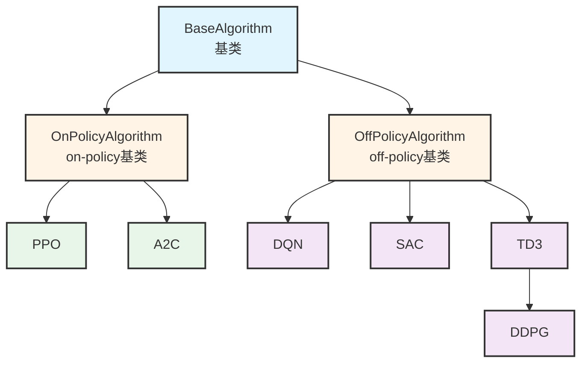
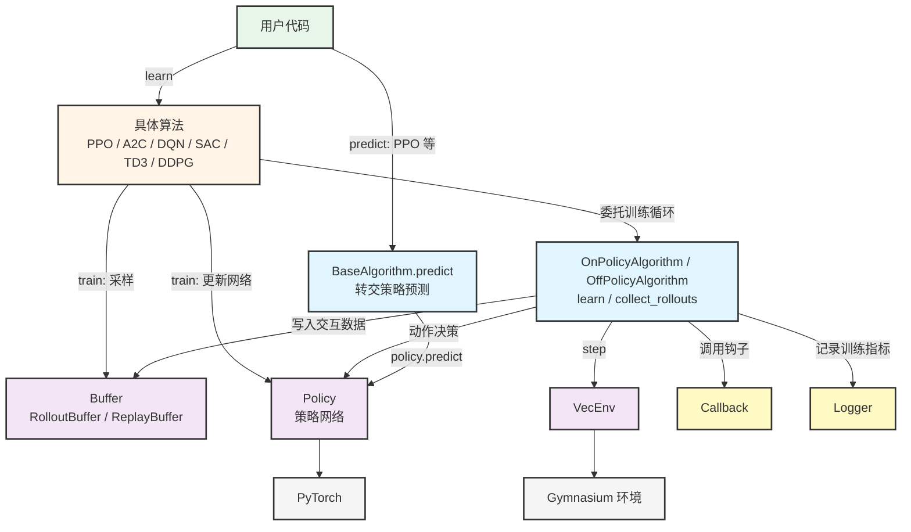

# Issue #01：项目地图与推荐阅读顺序

负责人：@成员03  
复核人：@成员01  
上游基线：见 `docs/project-baseline.md`

## 任务目标

为 Stable-Baselines3 项目梳理清晰的模块职责说明和代码阅读路径，帮助团队成员快速理解项目结构。

## 1. 项目基本情况

**统计数据**：
```bash
# 文件数量
find stable_baselines3/stable_baselines3 -type f -name "*.py" | wc -l
# 结果：64个Python文件

# 代码行数
find stable_baselines3/stable_baselines3 -type f -name "*.py" -exec wc -l {} + | tail -1
# 结果：15,693行代码
```

**目录结构**：
```
stable_baselines3/
├── __init__.py           # 入口文件
├── common/               # 公共模块（共享代码）
├── ppo/                  # PPO算法
├── a2c/                  # A2C算法
├── dqn/                  # DQN算法
├── ddpg/                 # DDPG算法
├── sac/                  # SAC算法
└── td3/                  # TD3算法
```

### 仓库目录与证据入口

这里的 `stable_baselines3/` 是上游仓库中的 Python 包。完整仓库还包括以下入口，不能把包目录当作整个项目：

| 目录/入口 | 职责 | 固定基线下的代表文件 |
|---|---|---|
| `README.md` | 项目介绍、安装方式、算法支持表和最小使用示例 | [README.md](https://github.com/DLR-RM/stable-baselines3/blob/7cfb4dd6055e74b5caa4ed4d6777492209946e26/README.md#L11) |
| `stable_baselines3/` | 算法、策略、缓冲区与环境包装实现 | [__init__.py](https://github.com/DLR-RM/stable-baselines3/blob/7cfb4dd6055e74b5caa4ed4d6777492209946e26/stable_baselines3/__init__.py#L1) |
| `tests/` | 验证预测接口、训练流程和边界行为 | [test_predict.py::test_predict](https://github.com/DLR-RM/stable-baselines3/blob/7cfb4dd6055e74b5caa4ed4d6777492209946e26/tests/test_predict.py#L62)；[test_run.py::test_ppo](https://github.com/DLR-RM/stable-baselines3/blob/7cfb4dd6055e74b5caa4ed4d6777492209946e26/tests/test_run.py#L49) |
| `docs/` | 用户指南和开发者设计说明；帮助区分公开接口与内部实现 | [docs/guide/developer.md](https://github.com/DLR-RM/stable-baselines3/blob/7cfb4dd6055e74b5caa4ed4d6777492209946e26/docs/guide/developer.md#L14) |
| `.github/` | GitHub 协作模板与自动化流程；CI 执行 lint、文档构建、类型检查和测试 | [.github/workflows/ci.yml](https://github.com/DLR-RM/stable-baselines3/blob/7cfb4dd6055e74b5caa4ed4d6777492209946e26/.github/workflows/ci.yml#L1) |
| `scripts/` | 测试和 Docker 运行辅助脚本 | [scripts/run_tests.sh](https://github.com/DLR-RM/stable-baselines3/blob/7cfb4dd6055e74b5caa4ed4d6777492209946e26/scripts/run_tests.sh#L1) |

职责依据是上表文件的内容；“先读 README 与开发指南，再从包入口追到具体算法，最后用测试核对行为”是本任务推荐的阅读路线。

---

## 2. 项目地图

### 2.1 架构图

展示SB3的类继承关系：


```mermaid
graph TD
    A[BaseAlgorithm<br/>基类] --> B[OnPolicyAlgorithm<br/>on-policy基类]
    A --> C[OffPolicyAlgorithm<br/>off-policy基类]

    B --> D[PPO]
    B --> E[A2C]

    C --> F[DQN]
    C --> H[SAC]
    C --> I[TD3]
    I --> G[DDPG]

    style A fill:#e1f5ff,stroke:#333,stroke-width:2px
    style B fill:#fff4e6,stroke:#333,stroke-width:2px
    style C fill:#fff4e6,stroke:#333,stroke-width:2px
    style D fill:#e8f5e9,stroke:#333,stroke-width:2px
    style E fill:#e8f5e9,stroke:#333,stroke-width:2px
    style F fill:#f3e5f5,stroke:#333,stroke-width:2px
    style G fill:#f3e5f5,stroke:#333,stroke-width:2px
    style H fill:#f3e5f5,stroke:#333,stroke-width:2px
    style I fill:#f3e5f5,stroke:#333,stroke-width:2px
```

[可编辑源文件](../../../artifacts/diagrams/issue-01/architecture.mmd) · [导出图](../../../artifacts/diagrams/issue-01/01architecture.png)

**图说明**：
- 🔵 **蓝色（BaseAlgorithm）**：顶层基类，定义所有算法的统一接口（learn、predict、save、load）
- 🟡 **黄色（中间层）**：按数据使用方式分为on-policy和off-policy两类
- 🟢 **绿色（PPO、A2C）**：on-policy算法，训练后丢弃旧数据
- 🟣 **紫色（DQN、DDPG、SAC、TD3）**：off-policy算法，可重用历史数据

**解释**：SB3采用三层继承设计，所有算法共享统一的API，用户使用任何算法都是同样的方式。唯一的例外是DDPG：它继承的是TD3（`ddpg/ddpg.py:L14`，`class DDPG(TD3)`），源码注释说明SB3把DDPG当作TD3的特例，所以DDPG比其他算法多一层。

---

### 2.2 模块协作地图

展示各模块在训练和预测时的协作关系：


```mermaid
graph TD
    U[用户代码] -->|learn| A[具体算法<br/>PPO / A2C / DQN / SAC / TD3 / DDPG]
    A -->|委托训练循环| T[OnPolicyAlgorithm / OffPolicyAlgorithm<br/>learn / collect_rollouts]
    A -->|train: 采样| B[Buffer<br/>RolloutBuffer / ReplayBuffer]
    A -->|train: 更新网络| P[Policy<br/>策略网络]
    T -->|动作决策| P
    T -->|写入交互数据| B
    T -->|step| V[VecEnv]
    T -->|调用钩子| C[Callback]
    T -->|记录训练指标| L[Logger]
    U -->|predict: PPO 等| X[BaseAlgorithm.predict<br/>转交策略预测]
    X -->|policy.predict| P
    V --> E[Gymnasium 环境]
    P --> F[PyTorch]

    style U fill:#e8f5e9,stroke:#333,stroke-width:2px
    style A fill:#fff4e6,stroke:#333,stroke-width:2px
    style T fill:#e1f5ff,stroke:#333,stroke-width:2px
    style X fill:#e1f5ff,stroke:#333,stroke-width:2px
    style P fill:#f3e5f5,stroke:#333,stroke-width:2px
    style B fill:#f3e5f5,stroke:#333,stroke-width:2px
    style V fill:#f3e5f5,stroke:#333,stroke-width:2px
    style C fill:#fff9c4,stroke:#333,stroke-width:2px
    style L fill:#fff9c4,stroke:#333,stroke-width:2px
    style E fill:#f5f5f5,stroke:#333,stroke-width:2px
    style F fill:#f5f5f5,stroke:#333,stroke-width:2px
```

[可编辑源文件](../../../artifacts/diagrams/issue-01/module-collaboration.mmd) · [导出图](../../../artifacts/diagrams/issue-01/02module-collaboration.png)

**图说明**：
- 🟢 **用户代码**：调用SB3的API（如`model.learn()`）
- 🟡 **具体算法**：用户选择的算法（PPO、DQN等）
- 🔵 **公共骨架**：OnPolicy/OffPolicy 负责训练调度，BaseAlgorithm 提供公共预测入口
- 🟣 **核心模块**：Policy负责决策，Buffer存储数据，VecEnv管理环境
- 🟨 **辅助模块**：Callback 提供训练钩子，Logger 记录指标
- ⚪ **外部依赖**：Gymnasium提供环境接口，PyTorch实现神经网络

**协作流程与范围**：

1. **用户代码** 创建算法实例，并调用 `learn()` 或 `predict()`。
2. **训练调度** 位于 `OnPolicyAlgorithm` / `OffPolicyAlgorithm`：`learn()` 调用 `collect_rollouts()`，后者使用 Policy 决策、通过 VecEnv 与环境交互、写入 Buffer，并调用 Callback 钩子；`learn()` 再调用具体算法的 `train()` 更新网络。
3. **具体算法的 `train()`** 从 Buffer 采样，计算损失并优化 Policy；中间层和具体算法通过 Logger 记录指标。
4. **预测入口** 对 PPO 等沿用基类实现的算法，是 `BaseAlgorithm.predict()` → `policy.predict()`；DQN 覆盖了算法层的 `predict()`，加入探索逻辑。
5. **BaseAlgorithm** 提供公共初始化、环境包装、回调/日志准备、保存与加载，以及抽象 `learn()` 接口；它不实现训练循环，也不负责创建和读写训练 Buffer。
6. **底层依赖**：Gymnasium 提供环境接口，PyTorch 实现神经网络。

图中的箭头表示所标注的方法调用或数据操作，不表示类继承。Callback 是训练循环的一部分，即使用户没有传入自定义回调，也会初始化回调对象。


---

**源码依据**：[BaseAlgorithm.learn（抽象接口）](https://github.com/DLR-RM/stable-baselines3/blob/7cfb4dd6055e74b5caa4ed4d6777492209946e26/stable_baselines3/common/base_class.py#L511)；[OnPolicyAlgorithm._setup_model](https://github.com/DLR-RM/stable-baselines3/blob/7cfb4dd6055e74b5caa4ed4d6777492209946e26/stable_baselines3/common/on_policy_algorithm.py#L115)；[OnPolicyAlgorithm.collect_rollouts](https://github.com/DLR-RM/stable-baselines3/blob/7cfb4dd6055e74b5caa4ed4d6777492209946e26/stable_baselines3/common/on_policy_algorithm.py#L162)；[OnPolicyAlgorithm.learn](https://github.com/DLR-RM/stable-baselines3/blob/7cfb4dd6055e74b5caa4ed4d6777492209946e26/stable_baselines3/common/on_policy_algorithm.py#L300)；[OffPolicyAlgorithm._setup_model](https://github.com/DLR-RM/stable-baselines3/blob/7cfb4dd6055e74b5caa4ed4d6777492209946e26/stable_baselines3/common/off_policy_algorithm.py#L177)；[OffPolicyAlgorithm.collect_rollouts](https://github.com/DLR-RM/stable-baselines3/blob/7cfb4dd6055e74b5caa4ed4d6777492209946e26/stable_baselines3/common/off_policy_algorithm.py#L526)；[PPO.train](https://github.com/DLR-RM/stable-baselines3/blob/7cfb4dd6055e74b5caa4ed4d6777492209946e26/stable_baselines3/ppo/ppo.py#L184)；[BaseAlgorithm.predict](https://github.com/DLR-RM/stable-baselines3/blob/7cfb4dd6055e74b5caa4ed4d6777492209946e26/stable_baselines3/common/base_class.py#L537)。设计说明另见 [开发指南](https://github.com/DLR-RM/stable-baselines3/blob/7cfb4dd6055e74b5caa4ed4d6777492209946e26/docs/guide/developer.md#L20)。

---

## 3. 核心模块职责

### 3.1 顶层入口（`__init__.py`）

**固定链接**：https://github.com/DLR-RM/stable-baselines3/blob/7cfb4dd6055e74b5caa4ed4d6777492209946e26/stable_baselines3/__init__.py

**职责**（来自源码）：
- 导出6个算法类：PPO, A2C, DQN, DDPG, SAC, TD3
- 导出工具函数：get_system_info()

**解释**：这是用户使用的入口，`from stable_baselines3 import PPO` 就是从这里导入的。

---

### 3.2 基础层（`common/base_class.py`）

**固定链接**：https://github.com/DLR-RM/stable-baselines3/blob/7cfb4dd6055e74b5caa4ed4d6777492209946e26/stable_baselines3/common/base_class.py

**职责**（来自源码注释）：
- 定义 `BaseAlgorithm` 抽象基类
- 声明 `learn()` 训练方法（抽象方法，由中间层实现）
- 提供 `predict()` 预测方法
- 提供 `save()` 和 `load()` 保存/加载方法

**关键代码位置**：

| 内容 | 行号 | 固定链接 |
|------|------|---------|
| 类定义和 `__init__` | L67-L202 | [L67](https://github.com/DLR-RM/stable-baselines3/blob/7cfb4dd6055e74b5caa4ed4d6777492209946e26/stable_baselines3/common/base_class.py#L67) |
| `learn()`（`@abstractmethod`） | L511-L535 | [L512](https://github.com/DLR-RM/stable-baselines3/blob/7cfb4dd6055e74b5caa4ed4d6777492209946e26/stable_baselines3/common/base_class.py#L512) |
| `predict()` | L537-L557 | [L537](https://github.com/DLR-RM/stable-baselines3/blob/7cfb4dd6055e74b5caa4ed4d6777492209946e26/stable_baselines3/common/base_class.py#L537) |
| `load()` | L643 | [L643](https://github.com/DLR-RM/stable-baselines3/blob/7cfb4dd6055e74b5caa4ed4d6777492209946e26/stable_baselines3/common/base_class.py#L643) |
| `save()` | L819 | [L819](https://github.com/DLR-RM/stable-baselines3/blob/7cfb4dd6055e74b5caa4ed4d6777492209946e26/stable_baselines3/common/base_class.py#L819) |

以下为省略参数和类型的结构示意，完整签名以固定源码链接为准：

```python
class BaseAlgorithm(ABC):          # L67
    """The base of RL algorithms"""

    @abstractmethod
    def learn(self, total_timesteps: int, ...) -> SelfBaseAlgorithm:   # L512
        """Return a trained model."""

    def predict(self, observation, ...) -> tuple[np.ndarray, ...]:     # L537
        return self.policy.predict(observation, state, episode_start, deterministic)
```

**解释**：所有算法都继承这个类，就像一个模板，定义了算法必须具备的功能。`learn()` 在这里只规定参数，真正的训练循环在中间层；`predict()` 则直接把工作交给策略网络 `policy.predict()`。

---

### 3.3 中间层（`common/on_policy_algorithm.py` 和 `off_policy_algorithm.py`）

#### 3.3.1 OnPolicyAlgorithm

**固定链接**：https://github.com/DLR-RM/stable-baselines3/blob/7cfb4dd6055e74b5caa4ed4d6777492209946e26/stable_baselines3/common/on_policy_algorithm.py

**职责**（来自源码注释）：
- On-policy算法的基类（A2C、PPO使用）
- 提供 `collect_rollouts()` 方法收集经验（L162-L268）
- 实现 on-policy 的 `learn()` 训练循环（L300）
- 使用 `RolloutBuffer` 存储数据

**解释**：On-policy算法每次更新后要丢弃旧数据，所以单独封装了收集数据的逻辑。这里的 `train()`（L270）只是抛出 `NotImplementedError` 的空壳，由PPO、A2C各自实现。

#### 3.3.2 OffPolicyAlgorithm

**固定链接**：https://github.com/DLR-RM/stable-baselines3/blob/7cfb4dd6055e74b5caa4ed4d6777492209946e26/stable_baselines3/common/off_policy_algorithm.py

**职责**（来自源码注释）：
- Off-policy算法的基类（DQN、SAC、TD3直接继承；DDPG经由TD3间接继承）
- 实现 off-policy 的 `learn()` 训练循环（L324）
- 声明 `train()` 接口（L372，由具体算法实现）
- 使用 `ReplayBuffer` 存储历史数据

**解释**：Off-policy算法可以重复使用旧数据，所以用ReplayBuffer保存历史经验。

---

### 3.4 算法实现层（`ppo/`, `a2c/`, `dqn/` 等）

以PPO为例：

**固定链接**：https://github.com/DLR-RM/stable-baselines3/blob/7cfb4dd6055e74b5caa4ed4d6777492209946e26/stable_baselines3/ppo/ppo.py

**目录结构**：
```
ppo/
├── __init__.py
├── ppo.py           # PPO算法实现
└── policies.py      # 定义 MlpPolicy/CnnPolicy/MultiInputPolicy 别名
```

**职责**（来自源码注释）：
- 实现PPO算法（Proximal Policy Optimization）
- 定义超参数：clip_range, n_epochs, batch_size等
- 实现 `train()` 方法计算PPO损失（L184）

**解释**：每个算法一个文件夹，主要实现train()方法，定义自己的损失函数。`ppo/policies.py` 没有新写网络，只是把 `common/policies.py` 里的 `ActorCriticPolicy` 等类起了 `MlpPolicy` 这样的别名。

---

### 3.5 公共工具模块（`common/` 目录）

| 文件 | 职责（来自文档/代码） | 理解 |
|------|---------------------|------|
| `policies.py` | 策略网络定义（Actor-Critic等） | 神经网络的结构 |
| `buffers.py` | 经验缓冲区（RolloutBuffer、ReplayBuffer） | 存储交互数据 |
| `env_checker.py` | 环境检查工具 | 验证环境是否符合Gymnasium接口 |
| `callbacks.py` | 训练回调机制 | 监控训练过程、保存模型等 |
| `logger.py` | 日志记录 | 输出训练指标到TensorBoard |
| `vec_env/` | 向量化环境 | 同时运行多个环境加速训练 |
| `preprocessing.py` | 数据预处理 | 图像归一化等 |
| `distributions.py` | 动作分布 | 高斯分布、分类分布等 |
| `torch_layers.py` | PyTorch网络层 | MLP、CNN等网络结构 |
| `utils.py` | 工具函数 | 各种辅助函数 |

**固定链接**（示例）：
- policies.py: https://github.com/DLR-RM/stable-baselines3/blob/7cfb4dd6055e74b5caa4ed4d6777492209946e26/stable_baselines3/common/policies.py
- buffers.py: https://github.com/DLR-RM/stable-baselines3/blob/7cfb4dd6055e74b5caa4ed4d6777492209946e26/stable_baselines3/common/buffers.py

---

## 4. 继承关系总结

```
BaseAlgorithm（基类）
    ├── OnPolicyAlgorithm（on-policy算法）
    │   ├── PPO
    │   └── A2C
    └── OffPolicyAlgorithm（off-policy算法）
        ├── DQN
        ├── SAC
        └── TD3
            └── DDPG（继承TD3）
```

**解释**：
- **第一层**：BaseAlgorithm定义所有算法共同的方法
- **第二层**：区分on-policy和off-policy两种类型
- **第三层**：具体算法实现各自的训练逻辑
- **特例**：DDPG继承TD3（`ddpg/ddpg.py:L14`），比其他算法多一层

---

## 5. AI使用记录

| 提问 | AI回答 | 验证方式 | 结果 |
|------|--------|---------|------|
| "SB3有多少代码？" | 约64个文件，15000+行 | 用find和wc命令统计 | ✅ 准确：64文件，15693行 |
| "common目录有哪些模块？" | 列举了base_class、policies等 | ls命令查看目录 | ✅ 核心模块都在 |
| "继承关系是怎样的？" | 三层：Base→OnPolicy/OffPolicy→算法，6个算法都直接继承中间层 | 最初只读了PPO/OnPolicy的类定义；复核时搜索所有 `class XXX(` | ⚠️ 部分错误：DDPG实际继承TD3（`ddpg/ddpg.py:L14`），已修正 |
| "learn()和predict()在哪？" | 都在BaseAlgorithm中定义，learn()包含训练循环 | 复核时按行号核对base_class.py | ⚠️ 部分错误：BaseAlgorithm.learn()（L512）是抽象方法，训练循环在OnPolicy（L300）/OffPolicy（L324）中；predict()在L537，已修正 |

**纠错案例**：最初AI给出的继承关系和行号"看起来合理"，我只抽查了PPO这一条链就标成了"正确"。复核人对照基线源码后指出 DDPG 继承 TD3、多处行号对不上。教训是：AI 给出的结构性结论需要逐个核对，不能只抽查一个例子；行号必须按固定 commit 实际检索得出。

---

## 6. 复核记录

**复核人**：成员01（对照 SB3 基线 7cfb4dd 源码）

| # | 复核意见 | 核实结果 | 修改 |
|---|---------|---------|------|
| 1 | DDPG 应继承 TD3，而非直接继承 OffPolicyAlgorithm | 属实（`ddpg/ddpg.py:L14`） | 两份文档的架构图、继承树、`architecture.mmd`/PNG 已改为 OffPolicyAlgorithm → TD3 → DDPG |
| 2 | base_class.py L67-L202 不含 learn/predict | 属实（learn L512，predict L537） | 补充各方法行号和固定链接 |
| 3 | policies.py L39 是 BaseModel | 属实（ActorCriticPolicy 在 L416） | 02 文档阅读路径2已修正 |
| 4 | buffers.py L200-L350 主要是 ReplayBuffer | 属实（ReplayBuffer L158-L342，RolloutBuffer L343 起） | 02 文档阅读路径3已修正 |
| 5 | `env.reset()` 返回 `(obs, info)` | 属实 | 02 文档两处示例改为 `obs, info = env.reset()` |
| 6 | `preprocess_obs` 未 import 且要求 Tensor | 属实（`preprocessing.py:L115` 断言输入为 `th.Tensor`） | 练习代码补全 import，先用 `policy.obs_to_tensor()` 转换 |

**自查补充**（复核意见之外，同时修正）：
- `BaseAlgorithm.learn()` 是抽象方法，原文"base_class 中的训练循环"表述有误
- `ppo/policies.py` 并非"通常为空"，而是定义了 MlpPolicy 等别名
- `collect_rollouts()` 范围应为 L162-L268（原写 L162-L250）
- 中间层的 `train()` 只是接口，实现位于各算法

## 7. PR #16 review 修正

- 训练协作图和说明改为 OnPolicy/OffPolicy 调度、具体算法更新、BaseAlgorithm 公共预测入口，并补充固定源码及开发指南依据。
- 补齐 `tests/`、`docs/`、`.github/`、`scripts/` 的职责和代表文件；阅读路线增加开发指南及顺序理由。
- 调试示例定义独立评估环境，显式配置 `tensorboard_log`，区分事件日志与 `evaluations.npz`。
- 两张图的 Mermaid 源文件与 PNG 统一放在 `artifacts/diagrams/issue-01/`，源文件与两份文档的 Mermaid 块保持一致。

### 示例运行验证

验证脚本：[scripts/issue_01_validate_examples.py](../../../scripts/issue_01_validate_examples.py)。脚本提取报告中的预测练习和 TensorBoard 示例并原样执行，在临时目录检查输出，退出后清理运行材料。

按[基线准备说明](../../project-baseline.md)检出并安装上游源码、激活虚拟环境后，在本协作仓库根目录运行（将路径替换为自己的上游目录）：

```bash
PYTHONPATH=/path/to/stable-baselines3 uv run --no-project --active --with tensorboard python scripts/issue_01_validate_examples.py
```

本次验证：macOS 27.0.1 / arm64，Python 3.13.5，PyTorch 2.14.0，Gymnasium 1.3.0；源码为固定 commit `7cfb4dd6055e74b5caa4ed4d6777492209946e26`，包版本为 `2.9.2a0`。示例未设随机种子，只验证接口、形状与日志产物，不以动作取值或回报衡量训练效果。

结果：原始观察形状 `(4,)`，预处理后形状 `(1, 4)`，预测成功；生成一个 TensorBoard 事件文件，包含 `eval/mean_reward` 和 `rollout/ep_rew_mean`，同时生成 `best_model.zip` 和 `evaluations.npz`。独立评估环境使用 Monitor 包装。

另外核对了两份文档的 Mermaid 块与图源完全一致、本地文件链接可达、固定源码链接的文件和行号存在；两张 PNG 已重新渲染并检查可读性。图表导出命令见[图表说明](../../../artifacts/diagrams/issue-01/README.md)。
