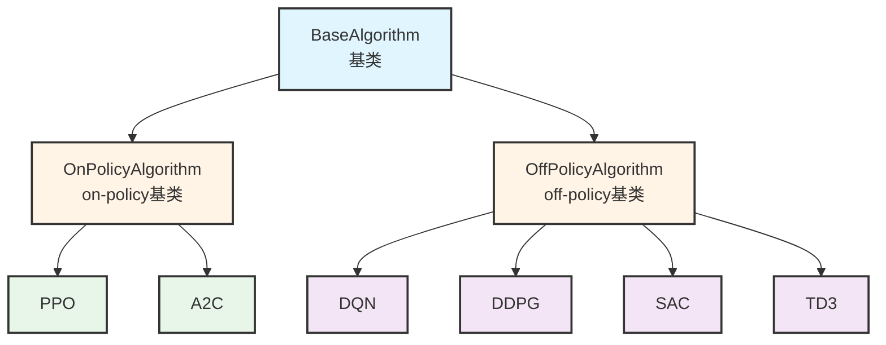
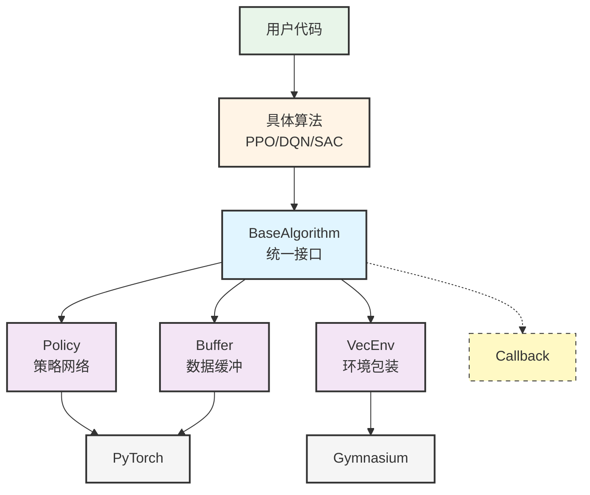

# 2. 项目地图

## 2.1 项目概况

Stable-Baselines3（简称SB3）是一个强化学习算法库，基于PyTorch实现。它提供了6种常用的强化学习算法，都遵循统一的API接口。

**基本数据**：
- 代码规模：64个Python文件，约15,693行代码
- 支持算法：PPO、A2C、DQN、DDPG、SAC、TD3
- 环境标准：Gymnasium（OpenAI Gym的升级版）

## 2.2 整体架构

### 2.2.1 目录结构

```
stable_baselines3/
├── __init__.py              # 导出所有算法
├── common/                  # 公共代码（所有算法共用）
│   ├── base_class.py        # 算法基类
│   ├── on_policy_algorithm.py   # on-policy算法基类
│   ├── off_policy_algorithm.py  # off-policy算法基类
│   ├── policies.py          # 策略网络
│   ├── buffers.py           # 数据缓冲区
│   └── ...                  # 其他工具模块
├── ppo/                     # PPO算法
├── a2c/                     # A2C算法
├── dqn/                     # DQN算法
├── ddpg/                    # DDPG算法
├── sac/                     # SAC算法
└── td3/                     # TD3算法
```

### 2.2.2 架构图



**图说明**：
- 🔵 蓝色：顶层基类（所有算法共同的接口）
- 🟡 黄色：中间层（区分算法类型）
- 🟢 绿色：on-policy算法（训练后丢弃数据）
- 🟣 紫色：off-policy算法（可重用历史数据）

### 2.2.3 三层设计

**第一层：BaseAlgorithm**
- 位置：`common/base_class.py`
- 作用：定义所有算法的通用方法
- 主要方法：`learn()`, `predict()`, `save()`, `load()`

**第二层：OnPolicy/OffPolicy**
- On-policy（`on_policy_algorithm.py`）：用于PPO、A2C
- Off-policy（`off_policy_algorithm.py`）：用于DQN、SAC、TD3
- 作用：区分数据使用方式

**第三层：具体算法**
- 每个算法一个文件夹（如`ppo/`）
- 实现自己的训练逻辑（`train()`方法）

### 2.2.4 另一视角—模块协作地图

从另一个视角看，SB3项目的各个模块是如何协作完成训练和预测任务的：



**图说明**：

这张图展示了从用户代码到底层实现的调用关系：

- 🟢 **用户层**：用户编写的训练/测试代码
- 🟡 **算法层**：用户选择的具体算法（PPO、DQN等）
- 🔵 **核心模块**：BaseAlgorithm提供统一接口，Policy和Buffer是关键组件
- 🟨 **工具模块**：辅助功能（环境包装、回调、日志）
- ⚪ **外部依赖**：Gymnasium环境标准和PyTorch深度学习框架

**核心协作流程**：

1. **用户代码** 创建算法实例（如PPO）
2. **算法类** 继承BaseAlgorithm，调用其learn()和predict()
3. **BaseAlgorithm** 协调各个模块：
   - 使用 **Policy** 进行动作决策
   - 使用 **Buffer** 存储和采样数据
   - 使用 **VecEnv** 与环境交互
   - 使用 **Callback** 监控训练
   - 使用 **Logger** 记录指标
4. **底层依赖** PyTorch实现神经网络，Gymnasium提供环境接口

这个视角帮助理解：**SB3如何将用户的简单调用，转化为复杂的强化学习训练流程**。

## 2.3 关键入口

### 入口速查表

| 入口 | 位置 | 作用 |
|------|------|------|
| **算法导入** | `stable_baselines3/__init__.py` | 导出PPO、DQN等算法类 |
| **模型训练** | `common/base_class.py` → `learn()` | 训练强化学习模型 |
| **动作预测** | `common/base_class.py` → `predict()` | 根据观察预测动作 |
| **模型保存** | `common/base_class.py` → `save()` | 保存训练好的模型 |
| **模型加载** | `common/base_class.py` → `load()` | 加载已保存的模型 |
| **环境包装** | `common/base_class.py` → `_wrap_env()` | 自动包装Gymnasium环境 |

---

### 1. 算法导入入口

**文件**：`stable_baselines3/__init__.py`

**固定链接**：https://github.com/DLR-RM/stable-baselines3/blob/7cfb4dd6055e74b5caa4ed4d6777492209946e26/stable_baselines3/__init__.py


**说明**：用户使用SB3的第一步，从这个文件导入需要的算法。统一的导出接口让用户不需要关心算法的具体位置。

**使用示例**：
```python
from stable_baselines3 import PPO, DQN, SAC
```

---

### 2. 模型训练入口

**文件**：`stable_baselines3/common/base_class.py`

**固定链接**：https://github.com/DLR-RM/stable-baselines3/blob/7cfb4dd6055e74b5caa4ed4d6777492209946e26/stable_baselines3/common/base_class.py

**方法**：`learn(total_timesteps, callback=None, ...)`

**核心流程**：
```
初始化 → 训练循环 → 返回模型
         ├─ 收集数据（与环境交互）
         ├─ 更新策略（训练神经网络）
         └─ 记录日志
```

**说明**：所有算法的统一训练接口。无论使用PPO、DQN还是SAC，都是调用`learn()`方法开始训练。

**使用示例**：
```python
model = PPO("MlpPolicy", "CartPole-v1")
model.learn(total_timesteps=10000)
```

---

### 3. 动作预测入口

**文件**：`stable_baselines3/common/base_class.py`

**固定链接**：https://github.com/DLR-RM/stable-baselines3/blob/7cfb4dd6055e74b5caa4ed4d6777492209946e26/stable_baselines3/common/base_class.py

**方法**：`predict(observation, deterministic=False, ...)`

**核心流程**：
```
观察值 → 预处理 → 神经网络 → 动作
```

**说明**：训练后使用模型的接口。根据当前观察值，通过策略网络计算并返回应该执行的动作。

**使用示例**：
```python
obs = env.reset()
action, _states = model.predict(obs, deterministic=True)
```

---

### 4. 模型保存入口

**文件**：`stable_baselines3/common/base_class.py`

**固定链接**：https://github.com/DLR-RM/stable-baselines3/blob/7cfb4dd6055e74b5caa4ed4d6777492209946e26/stable_baselines3/common/base_class.py

**方法**：`save(path)`

**说明**：将训练好的模型保存到文件，包括神经网络参数、超参数配置等。保存后可以随时加载使用，无需重新训练。

**使用示例**：
```python
model.save("ppo_cartpole")
```

---

### 5. 模型加载入口

**文件**：`stable_baselines3/common/base_class.py`

**固定链接**：https://github.com/DLR-RM/stable-baselines3/blob/7cfb4dd6055e74b5caa4ed4d6777492209946e26/stable_baselines3/common/base_class.py

**方法**：`load(path, env=None, ...)`（类方法）

**说明**：从文件加载已保存的模型。可以在加载时指定新的环境，这样同一个模型可以在不同环境中测试。

**使用示例**：
```python
model = PPO.load("ppo_cartpole")
# 或指定环境
model = PPO.load("ppo_cartpole", env=new_env)
```

---

### 6. 环境包装入口

**文件**：`stable_baselines3/common/base_class.py`

**固定链接**：https://github.com/DLR-RM/stable-baselines3/blob/7cfb4dd6055e74b5caa4ed4d6777492209946e26/stable_baselines3/common/base_class.py

**方法**：`_wrap_env(env, verbose=0, monitor_wrapper=True)`（静态方法）

**说明**：自动将Gymnasium环境包装成SB3需要的格式。主要功能包括：
- 包装成向量化环境（VecEnv）
- 添加Monitor记录episode信息
- 处理图像观察的通道顺序

**核心逻辑**：用户传入的环境会自动经过这个方法包装，通常不需要手动调用。

---

### 完整使用流程示例

```python
import gymnasium as gym
from stable_baselines3 import PPO

# 1. 导入算法（从 __init__.py）
# 2. 创建环境
env = gym.make("CartPole-v1")

# 3. 创建模型（自动调用 _wrap_env 包装环境）
model = PPO("MlpPolicy", env, verbose=1)

# 4. 训练（调用 learn()）
model.learn(total_timesteps=10000)

# 5. 保存（调用 save()）
model.save("ppo_cartpole")

# 6. 加载（调用 load()）
model = PPO.load("ppo_cartpole")

# 7. 使用（调用 predict()）
obs, info = env.reset()
action, _states = model.predict(obs, deterministic=True)
```


## 2.4 推荐阅读顺序

### 快速开始指南（引自官方README）

在深入代码之前，建议先通过以下方式快速上手：

#### 1. 安装SB3

```bash
# 完整安装（包含TensorBoard、OpenCV等）
pip install 'stable-baselines3[extra]'

```

**环境要求**：
- Python 3.10+
- PyTorch >= 2.8

#### 2. 也可在线试用（不需要本地安装）

SB3提供了Google Colab笔记本，可以直接在浏览器中运行：

- [快速入门教程](https://colab.research.google.com/github/Stable-Baselines-Team/rl-colab-notebooks/blob/sb3/stable_baselines_getting_started.ipynb)
- [保存和加载模型](https://colab.research.google.com/github/Stable-Baselines-Team/rl-colab-notebooks/blob/sb3/saving_loading_dqn.ipynb)
- [多进程训练](https://colab.research.google.com/github/Stable-Baselines-Team/rl-colab-notebooks/blob/sb3/multiprocessing_rl.ipynb)
- [监控训练过程](https://colab.research.google.com/github/Stable-Baselines-Team/rl-colab-notebooks/blob/sb3/monitor_training.ipynb)

**建议**：先在Colab上跑几个例子，感受一下SB3的使用方式，再开始看代码。

#### 3. 核心概念理解

在阅读代码前，需要理解几个核心概念：

| 概念 | 解释 | 为什么重要 |
|------|------|----------|
| **Policy（策略）** | 从观察到动作的映射（神经网络） | 这是智能体的"大脑" |
| **Environment（环境）** | 智能体交互的世界（Gymnasium） | 遵循标准接口 |
| **Timestep（时间步）** | 一次动作执行 | 训练的基本单位 |
| **Episode（回合）** | 从开始到结束的一次完整过程 | 如一局游戏 |
| **Buffer（缓冲区）** | 存储交互数据 | 用于训练 |
| **Callback（回调）** | 训练过程中的自定义操作 | 监控、保存、早停等 |

---

### 阅读顺序1：快速入门（适合新手）

**目标**：了解整体结构和基本用法

**前置知识**：
- 基本的Python语法
- 了解什么是强化学习（建议先看[官方RL入门文档](https://stable-baselines3.readthedocs.io/en/master/guide/rl.html)）

**阅读顺序**：

| 步骤 | 文件 | 重点内容 | 预计时间 |
|------|------|---------|---------|
| 1 | 先跑一个例子 | 复制README中的例子，成功训练一个模型 | 20分钟 |
| 2 | `__init__.py` | 看导出了哪些算法 | 10分钟 |
| 3 | `common/base_class.py` L67-L202 | BaseAlgorithm类结构、learn()和predict()签名 | 40分钟 |
| 4 | `common/on_policy_algorithm.py` L21-L113 | OnPolicyAlgorithm怎么继承BaseAlgorithm | 30分钟 |
| 5 | `ppo/ppo.py` L18-L136 | PPO的超参数和初始化 | 40分钟 |
| 6 | 修改例子 | 尝试改变超参数、换个环境 | 40分钟 |

**预计总时间**：3小时

**学到什么**：
- ✅ 知道如何使用SB3训练模型
- ✅ 理解三层继承结构
- ✅ 能够阅读和修改训练脚本

---

### 阅读顺序2：为理解预测流程准备

**目标**：搞清楚`predict()`怎么工作的，从观察到动作的完整流程

**前置知识**：
- 完成路径1
- 基本的PyTorch知识（神经网络、forward传播）

**阅读顺序**：

| 步骤 | 文件 | 重点内容 | 预计时间 |
|------|------|---------|---------|
| 1 | `common/base_class.py` | predict()方法的实现 | 30分钟 |
| 2 | `common/policies.py` L39-L150 | ActorCriticPolicy类、forward()方法 | 60分钟 |
| 3 | `common/torch_layers.py` | 特征提取器（FlattenExtractor、NatureCNN） | 40分钟 |
| 4 | `common/preprocessing.py` | preprocess_obs()如何处理不同类型的观察 | 30分钟 |
| 5 | `common/distributions.py` | 动作分布（高斯分布、分类分布） | 40分钟 |
| 6 | `tests/test_predict.py` | 看单元测试理解预期行为 | 30分钟 |

**实践练习**：
```python
# 打印中间结果，理解数据流
obs = env.reset()
print("原始观察:", obs.shape)

# 预处理
preprocessed = preprocess_obs(obs, env.observation_space)
print("预处理后:", preprocessed.shape)

# 预测
action, _ = model.predict(obs, deterministic=True)
print("输出动作:", action)
```

**预计总时间**：3-4小时

**学到什么**：
- ✅ 能够画出predict()的完整调用链
- ✅ 理解神经网络如何从观察计算动作
- ✅ 知道如何处理不同类型的观察空间

---

### 阅读顺序3：为理解训练流程准备

**目标**：搞清楚`learn()`怎么工作的，完整的训练循环

**前置知识**：
- 完成路径1和路径2
- 理解强化学习的基本概念（策略梯度、价值函数）

**阅读顺序**：

| 步骤 | 文件 | 重点内容 | 预计时间 |
|------|------|---------|---------|
| 1 | `common/base_class.py` | learn()方法的训练循环 | 40分钟 |
| 2 | `common/on_policy_algorithm.py` L162-L250 | collect_rollouts()如何收集数据 | 60分钟 |
| 3 | `common/buffers.py` L27-L100, L200-L350 | RolloutBuffer的数据结构和采样 | 60分钟 |
| 4 | `ppo/ppo.py` (train方法) | PPO的损失函数计算和优化 | 80分钟 |
| 5 | `common/callbacks.py` | 回调机制（保存模型、早停等） | 30分钟 |
| 6 | `common/logger.py` | 日志记录和TensorBoard | 20分钟 |
| 7 | `tests/test_run.py` | 端到端训练测试 | 30分钟 |

**调试建议**：
```python
# 在训练时使用回调监控
from stable_baselines3.common.callbacks import EvalCallback

eval_callback = EvalCallback(
    eval_env,
    best_model_save_path="./logs/",
    log_path="./logs/",
    eval_freq=1000,
    verbose=1
)

model.learn(total_timesteps=10000, callback=eval_callback)

# 使用TensorBoard查看训练曲线
# 终端运行：tensorboard --logdir ./logs/
```

**预计总时间**：5-6小时

**学到什么**：
- ✅ 能够画出learn()的完整调用链
- ✅ 理解数据收集和策略更新的过程
- ✅ 知道如何监控和调试训练过程

---

### 进阶资源（可选）

**官方文档**：
- [完整文档](https://stable-baselines3.readthedocs.io/)
- [自定义环境](https://stable-baselines3.readthedocs.io/en/master/guide/custom_env.html)
- [自定义策略](https://stable-baselines3.readthedocs.io/en/master/guide/custom_policy.html)
- [回调机制](https://stable-baselines3.readthedocs.io/en/master/guide/callbacks.html)

**相关项目**：
- [RL Baselines3 Zoo](https://github.com/DLR-RM/rl-baselines3-zoo)：提供调好的超参数和训练脚本
- [SB3-Contrib](https://github.com/Stable-Baselines-Team/stable-baselines3-contrib)：实验性算法（如Recurrent PPO）

## 2.5 模块速查表

| 模块 | 文件 | 主要作用 |
|------|------|---------|
| 算法基类 | `common/base_class.py` | 定义`learn()`和`predict()` |
| On-policy基类 | `common/on_policy_algorithm.py` | PPO、A2C的基础 |
| Off-policy基类 | `common/off_policy_algorithm.py` | DQN、SAC、TD3的基础 |
| 策略网络 | `common/policies.py` | 神经网络结构 |
| 数据缓冲 | `common/buffers.py` | 存储交互数据 |
| 环境检查 | `common/env_checker.py` | 验证环境合法性 |
| 向量化环境 | `common/vec_env/` | 并行运行环境 |
| PPO算法 | `ppo/ppo.py` | PPO实现 |

**所有源码链接**基于commit：`7cfb4dd6055e74b5caa4ed4d6777492209946e26`

详细的模块职责和源码位置见：[`docs/evidence/issues/issue-01.md`](../evidence/issues/issue-01.md)

## 2.6 如何帮助其他任务

| 任务 | 本章如何帮助 |
|------|------------|
| T02（对象与类图） | 参考2.2节的继承关系 |
| T03（predict调用链） | 使用路径2的阅读顺序，从2.3节的predict入口开始 |
| T04（learn训练链） | 使用路径3的阅读顺序，从2.3节的learn入口开始 |
| T05（环境检查） | 查看2.3节的环境包装入口和`env_checker.py`模块 |
| T06（运行实验） | 参考2.3节的完整使用流程示例 |

---

**证据来源**：本章内容基于源码分析和官方README，详细证据见[`docs/evidence/issues/issue-01.md`](../evidence/issues/issue-01.md)
