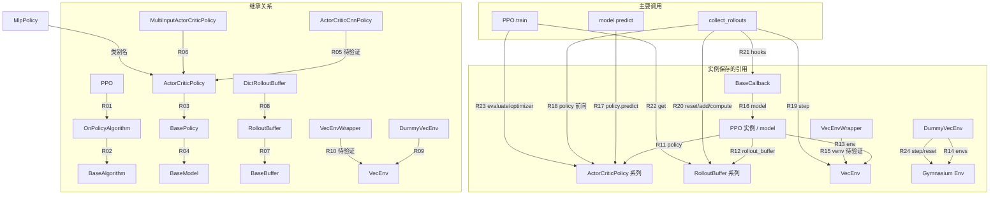

# 3. 核心领域对象与类图

PPO 通过算法对象组织 policy、采样 buffer 和批量环境。本文分析固定 commit `7cfb4dd6055e74b5caa4ed4d6777492209946e26`；对象词典、源码定位和验证状态见 [T02 证据](../evidence/issues/issue-02.md)。

[可编辑 Mermaid 源文件](../../artifacts/diagrams/issue-02/domain-objects.mmd)

图按继承、保存的引用和调用分组；“待验证”表示缺少专项运行证据。R01–R24 可在证据文件逐条核对，图不表示执行时序。

`PPO → OnPolicyAlgorithm → BaseAlgorithm` 是继承链；一个 PPO 实例复用基类行为。BaseAlgorithm 提供环境包装、预测委托和 callback 初始化，OnPolicyAlgorithm 创建 policy/buffer 并编排采样，PPO 实现 `train`。MlpPolicy 是 ActorCriticPolicy 的类别名；CnnPolicy 和 MultiInputPolicy 分别指向其 CNN 与多输入子类。policy 同时负责动作、value、log probability，并持有 optimizer。

算法保存 `self.env`，其内部接口为 VecEnv。普通 Gymnasium Env 默认先由 Monitor 包装，再放入 DummyVecEnv；VecEnv 不继承 Gymnasium Env。DummyVecEnv 把单环境五元 step 返回转换为 SB3 的批量四元结果，在 episode 结束时保存 terminal observation 并自动 reset。env 可以为空以支持仅预测的加载模型，训练则需要环境。

RolloutBuffer 每轮 reset、填充、计算 returns/advantages，然后由 PPO.train 按 batch 读取。下轮采样覆盖数据，buffer 对象跨轮复用。Dict 观测默认选择 DictRolloutBuffer。T03 的 `model.predict` 委托 `policy.predict`，不向 buffer 写数据；T04 的 `collect_rollouts` 直接调用 policy、step 环境、填充 buffer，接着 `train` 读取 batch。

Callback 在 learn 初始化时保存 model 引用，并在 learn/collect_rollouts 间作为局部参数传递。`on_step` 返回 false 时在 buffer.add 前停止，停止轮不进入 train。固定源码实验完成两轮 CartPole 训练、提前停止与 Dict 分支，结果 PASS；CNN、VecEnvWrapper 与自动 reset 终止分支仍保留为待验证，详见 [C-02-01–C-02-06](../evidence/issues/issue-02.md)。
